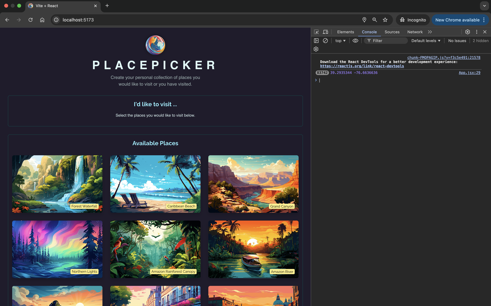

# Vacation Planner 🌎

PlacePicker is an interactive web application built with React.js that allows users to create and manage a personal collection of places they would like to visit or have visited. Users can select places, save their selections to local storage, and manage them seamlessly.



## Features

### 1. Select and Manage Favorite Places

- Users can browse through a curated collection of picturesque destinations.
- Save their selected places to a "Favorites" list stored in `localStorage`.

### 2. Persistent State with `localStorage`

- Places selected by users are stored locally, so their preferences persist even when the page is refreshed.
- **Upcoming Improvement**: Implement functionality to update `localStorage` when a place is removed from the selected list.

### 3. Optimized Component Rendering

- Utilized `useCallback` to prevent infinite re-rendering loops when functions are passed as dependencies in `useEffect`.

### 4. Clean-Up Functionality

- Incorporated `useEffect` cleanup functions to manage timers and avoid memory leaks. This is particularly useful for managing modal timers.

### 5. Dynamic Location Fetching

- The app dynamically fetches the user's location using the browser's Geolocation API and displays it in the console.

---

## Key Learning Highlights

### 1. Avoiding Infinite Component Re-Renders

- Without proper dependency management in `useEffect`, infinite re-renders may occur.
- For example, fetching the user’s location without wrapping the fetch function in `useCallback` caused repeated re-execution of the `App` component.

### 2. Managing Local Storage

- Implemented logic to save selected places to `localStorage`.
- **Planned Feature**: Update `localStorage` when places are removed from the selected list.

### 3. `useEffect` Cleanup

- Used the cleanup function within `useEffect` to clear timeouts set for modals. This ensures no unintended timers run after component unmounting.

### 4. Using `useCallback`

- `useCallback` was employed to memoize functions passed as dependencies in `useEffect`. This avoids unnecessary re-executions, enhancing performance.

---

## Technologies Used

- **Frontend**: React.js
- **State Management**: React Hooks (`useState`, `useEffect`, `useCallback`)
- **Persistence**: `localStorage`
- **Styling**: CSS
- **Geolocation**: Browser Geolocation API

---

## Screenshots

### Homepage:

The homepage displays a variety of visually appealing destinations available for selection.


---

## How to Run Locally

1. Clone the repository:
   ```bash
   git clone https://github.com/your-username/placepicker.git
   cd placepicker
   ```
2. Install dependencies:
   ```bash
   npm install
   ```
3. Start the development server:
   ```bash
   npm start
   ```
4. Open the app in your browser at `http://localhost:5173`.

---

## Planned Improvements

1. **`localStorage` Updates**: Automatically remove a place from `localStorage` when it is unselected by the user.
2. **Additional Features**: Add categories or tags for places (e.g., Beaches, Mountains).
3. **Responsive Design**: Optimize for mobile and tablet devices.

---

## Contributing

Contributions are welcome! Feel free to open issues or submit pull requests to improve the app.

---

## License

This project is licensed under the MIT License.
